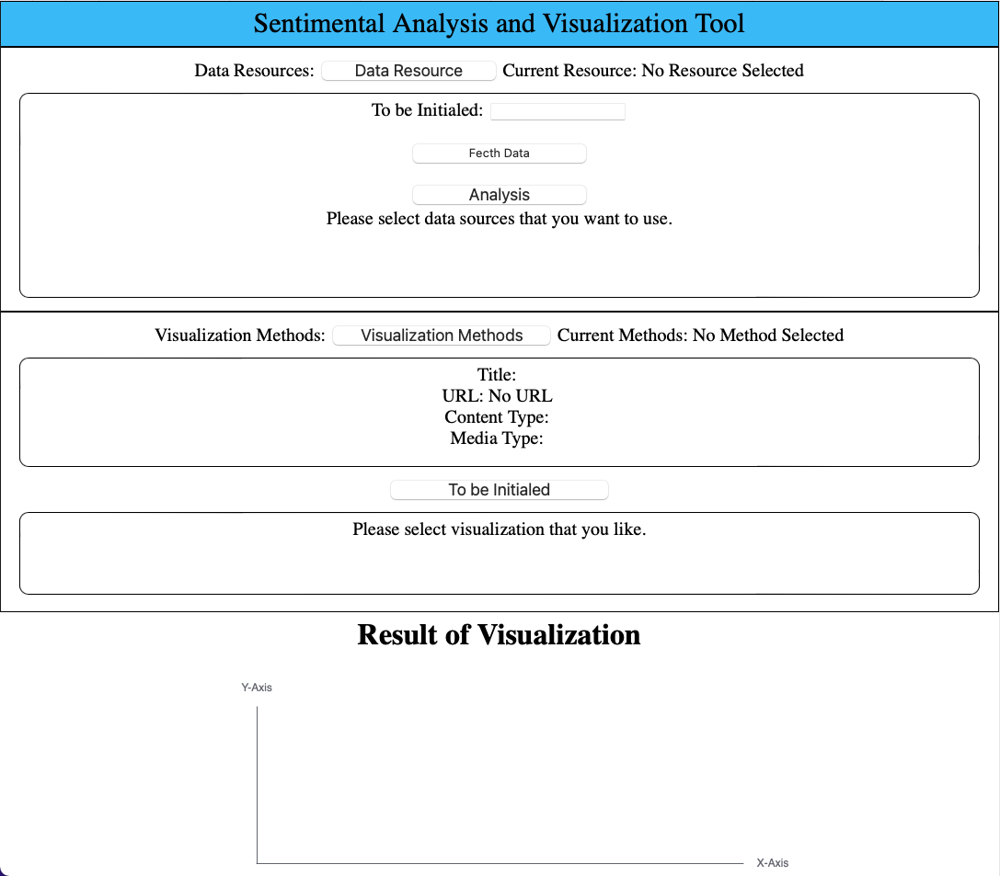
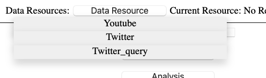
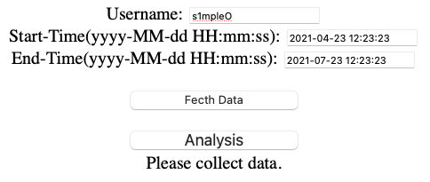
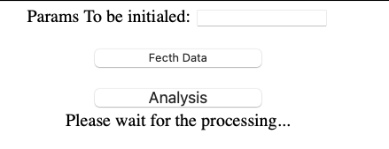
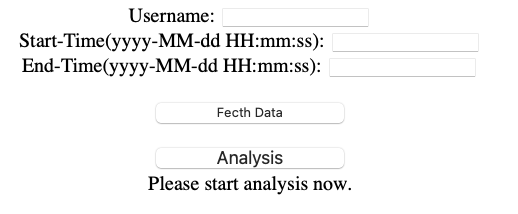
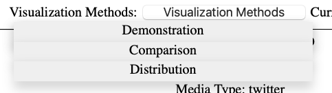
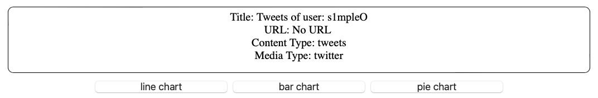
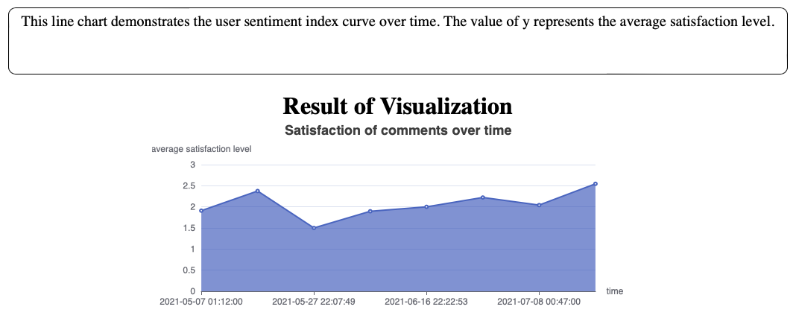

# Sentiment Analysis and Visualization

This is GitHub repo for CMU 17-514 HW6.

- Team Name: Anti_AntiBug

- Team Member: Shenhao Wang, Yihan Yang, Zihong Shi

This project's frame work mainly based on [CoreNLP](https://stanfordnlp.github.io/CoreNLP/api.html) API to implement sentimental analysis.

# Run the project

For backend, run:

```bash
mvn -f backend/pom.xml exec:java -Dexec.mainClass="org.antiantibug.App"
```

For frontend, please install frontend dependencies first:

```bash
npm install --prefix frontend/
```

Then run to start:

```bash
npm run start --prefix frontend/
```

# Guidlines

After successfully running the project, you will see page like this:



There are 2 parts in total, above is data part, below is visualization part.

There are Instruction in both parts.

## Choose Data Source



Click the button, there would be several options provided. (**Twitter** would be used in this file as an example)

## Input Params

After choosing the data source, please input relevant information to get the data, such as:



## Collect Data

After inputting params, now press "Fetch Data" button, and page would be like:



Please wait until process finished, and instruction updated, page would become:



## Start Analysis

Now press "Analysis" button, and wait again.

ATTENTION: if requested data are of huge amount, the waiting time would be rather long.

## Choose Visualization Method

Do the same choosing for visualization method:



After, specifying the visual method, the buttons below would change relatively:



## Choose Which Map To Show

Now press any button you want to show the analysis and visualization results!

The text area above the map would also update, which demonstrates for the map information.



# Design and Extension

## Data Plugin

The DataPlugin interface is an interface to be implemented by other specific plugins. The whole project is used for sentiment analysis, the function of **DataPlugin** is providing text fragments with corresponding time stamps for **framework**.

The DataPlugin can access text and time stamps data from various API provided by some applications, such as getting a list of tweets in a  week from a specific user using method provided by Twitter API. Plugin needs to provide a fixed number of pieces of data for the framework, so that the framework can make sentiment anaylsis correctly.

The DataPlugin should provide following data for the framework:

- title. The title is expected to clearly summarize the data being analyzed.
- content. The Content is text fragments accessed from an API, the text should be of String type and stored in a List.
- time. The time represents time stamps of text fragments. A time stamp is always a published time of a piece of text. No matter what type of time stamps are retrieved, they should be converted into type of Instant by toInstant() method, and the data should also be stored in a list.
- contentType. This is used to indicate where the texts are accessed, such as 'tweet' or 'Youtube comments'.
- mediaType.  This is used to indicate what media the data was obtained from, such as 'Twitter', 'Youtube' or 'News'.
- count. The size of content. In other words, this illustrates how many texts are stored in content list.

The above data should be stored in a Map<String, Object>. The keys are 'title', 'content', etc. And the values are their data such as 'content list', 'time stamps list' or a string.

The framework will get the data through a *Map<String, Object> provideData(Map<String, String> params)* method and implement sentiment analysis.

## Visual Plugin

The role of visual plugin is to get the processing data from framework, analyze the data and present data as various types of charts. In this project, we design three different visual plugins to demonstrate the data after analysis. The framework is to do the sentiment analysis to the text and result in form of different rates which vary from 0 to 4. In visual plugin, firstly, we need to use register(Framework framework) function to register the corresponding framework. Then we could call the function in framework to get the results of NLP sentiment analysis and other raw data. Then we need to design the parameters in the visual plugin. First is the name of the plugin and the number of buttons which depend on the number of plot you would like to demonstrate. In the first visual plugin, for example, we would like to depict three charts which are line chart, bar chart and pie chart to demonstrate the NLP sentiment analysis result. Then we need to create a list of string of which length is three and add the name of buttons in it. After setting all the parameters, the framework could call the corresponding function to get parameters and demonstrate them in the web. Then we need to write a plot() function to plot the chart and transfer the result in json string to the framework. 

In the plot() function, we use the echart library to plot figures. First we need to preprocess the data get from framework. And then we need to create new instance of different types of chart (Line(), Pie(), Bar(), etc.). And we need to add the data of X and Y in the instance and set the xlabel, ylabel, legend and title. Finally, we need to set other related parameters such as the color or the font size. After that we need to render the result plot into a json string and transfer the string to the framework by using setMap(). Then the  framework could use this string to demonstrate the chart in web by calling the echart package which has been deployed in the frontend. 

To extend a new visual plugin, we only need to realize the function in the visual plugin interface and change the corresponding parameters. And in the plot function, the data is analyzed differently and then plotted differently. Therefore, the visual plugin is very easy to be extended to achieve different function.
