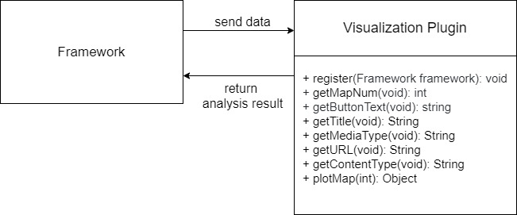

# Domain

This framework is to implement sentiment analysis on different texts. It performs the sentiment analysis on text from different sources (provided by data plugins) and shows results in different ways (using visualization plugins). The framework performs the sentiment analysis itself, so the framework can be reused for different types of sources by providing different plugins.

Data plugins could provide a list of text fragments with corresponding time stamps.

Specific plugins are implemented by implementing DataPlugin interface. Specific data plugins include:

- Twitter plugin that takes in a generic feed of Twitter messages, or a user's Twitter messages using their handle with the Twitter API.

- YouTube plugin that can take in comments from different videos using the YouTube Data API.

The framework could provide a list of text fragments with time stamps and sentiment score to visualization plugins. Visualization plugins could include:

- Time-series line chart displaying the sentiment in a video's comment filed over time.
- The heat map depicting the overall user satisfaction.
- The correlation among different types of satisfaction level 

# Generality vs specificity

For our design, we mainly divide the front page into 4 parts, including **Data Plugin Params Area**, **Visual Plugin Text Area**, **Visual Plugin Map Area** and **Visual Plugin Button Area**.

- For **Visualization Plugin Text Area** and **Visual Plugin Map Area**, we provide following functions in `Framework` interface, so that for every customized Visualization Plugin, these two functions are reusable.

  ```java
  /**
   * Set main description of presented map.
   * @param text description of presented map
   */
  void setMapText(String text);
  
  /**
   * Set presented map.
   * TODO: what type of input?
   */
  void setMap(Object map);
  ```

   Visualization plugin developers just need to design their own text and map to support specificity.

- For **Data Plugin Params Area** and **Visual Plugin Button Area**, we also offer several APIs to allow Plugin developers interact with our framework. These APIs are as follows:

  ```java
  /**
   * Set params' description.
   * @param paramNum number of requested param
   * @param text description of requested param
   */
  void setDataParamText(int paramNum, String text);
  
  /**
   * Set map buttons' description.
   * @param mapNum number of this button
   * @param text description of requested button
   */
  void setMapButtonText(int mapNum, String text);
  ```

  Our framework allows reusability by authorizing plugin developers to control data plugin parameter number, their text areas in front page, visualization plugin map number and their buttons in front page.

  Parameter number and map button number are defined by constants of different plugins, once plugin is registered, frame work would be informed with such information, and define these numbers.

  By calling these function, developer could set their own parameter name, map button name for each param or each map button, maximizing generality of our framework. At the meanwhile, this methods also allow considerable level of specificity.

- To enable further flexibility, we do not set lots of boundaries for plugins. Plugin developers could inject their own ideas into their plugins, and bare little restrictions.

  For an example, visual plugin could set different text format and content for a map as long as it is of string type. They could do centering, left-alignment, right-alignment or any other format type.

  For map presentation, it can also have numerous different features as creator wants. Once their type is acceptable, we do not require more about it, and also do not check every details about it.

# Project structure

Our project structure is as follows, first level items are all packages under `org.antiantibug` package:

- framework
  - core
    - Framework
    - DataPlugin
    - VisualPlugin
    - FrameworkImpl
  - gui
    - DataParam
    - MapButton
    - State
    - Plugin
- dataplugin
  - Customized Data Plugin Classes ......
- visualplugin
  - Customized Visualization Plugin Classes ......

# Plugin interfaces

## Data Plugin

The DataPlugin interface is an interface to be implemented by some specific plugins such as YoutubePlugin and TwitterPlugin. The DataPlugin interface is consist of some methods that get texts information from different sources, such as a tweet or comments from a video. These methods can be called by framework and framework will get information like texts from DataPlugin by calling its methods.

The DataPlugin contains following methods:

```java
/**
 * This method is called when the plugin is first registered with the framework. It provides a chance for
 * the plugin to perform initial set-up.
 */
void register(Framework framework)

/**
 * This method is used to get the number of requested parameters by other sentiment analysis API like
 * Twitter API and Youtube Data API. Different API requires different parameters, 
 * so this method is used to get a definite number of parameters.
 */
int getParamNum()
    
/**
 * This method is used to get description of required parameters for a source. For example, it may
 * require ‘title’, ‘url’ and ‘media tag’ for a video source. This method can get specific 
 * description of parameters of a specific source.
 */
String getParamText(int paramNum)

/**
 * This method is used to get string value of parameters of a source. Then the value can be 
 * stored or processed by target API.
 */
String getParam(int paramNum)

/**
 * This method is used to provide data by requesting target API. The relevant data is stored in a Map.
 */
Map<String, Object> provideData()
```

The specific plugin class can be implemented by implementing DataPlugin interface and override above methods according to their features.

In specific plugin class which implements DataPlugin interface, there is a Map to store data. And the framework can get sufficient information from this Map.

## Visualization Plugin

The visualization plugin gets processing data and the result of NLP analysis from the framework and plots the corresponding charts to visualize the data. Then the plugin transfer the charts back to the framework and the framework would post request to the frontend to demonstrate the charts.

The object domain model of visualization plugin interface would be shown as follows:



The key methods in the visualization plugin interface would be shown as follows:

```java
/**
 * Called (only once) when the plug-in is first registered with the
 * framework, giving the plug-in a chance to perform any initial set-  	* up before the game has begun (if necessary).
 *
 * @param framework The {@link Framework} instance with which the    
 *	plug-in was registered.
 */
void register(Framework framework);
```

```java
/**
 * Get fixed number of requested buttons.
 * @return number of requested buttons
 */
int getMapNum();
```

```java
/**
 * Get description of requested button.
 * @param buttonNum number of requested button
 * @return description of requested button
 */
String getButtonText(int buttonNum);
```

```java
/**
 * Get data resource title;
 * @return data resource title
 */
String getTitle();
```

```java
/**
 * Get data resource media type;
 * @return data resource media type
 */
String getMediaType();
```

```java
/**
 * Get data resource URL;
 * @return data resource URL
 */
String getURL();
```

```java
/**
 * Get data resource content type;
 * @return data resource content type
 */
String getContentType();
```

```java
/**
 * Plot requested map.
 * @param mapNum number of requested buttons
 * @return requested map
 */
Object plotMap(int mapNum);
```

The framework would transfer an object which contains the information visualization plugin needs to plot the figure. The data structure would be shown as follows:

```java
public class VisualData {
    private final String chartype;
    private final String title;
    private final String x_label;
    private final String y_label;
    private final List<double> X_data;
    private final List<double> Y_data;
    private final List<String> legend;
    private final List<String> color;
}
```

The data structure contains the type of the chart (bar chart, pie chart, etc.), the title of the chart, and the label of x axis and y axis. The data of x and y would be transfered by list of double elements. And if the data of y is in multiple dimension, then for each dimension there will be related figure legend and color.

